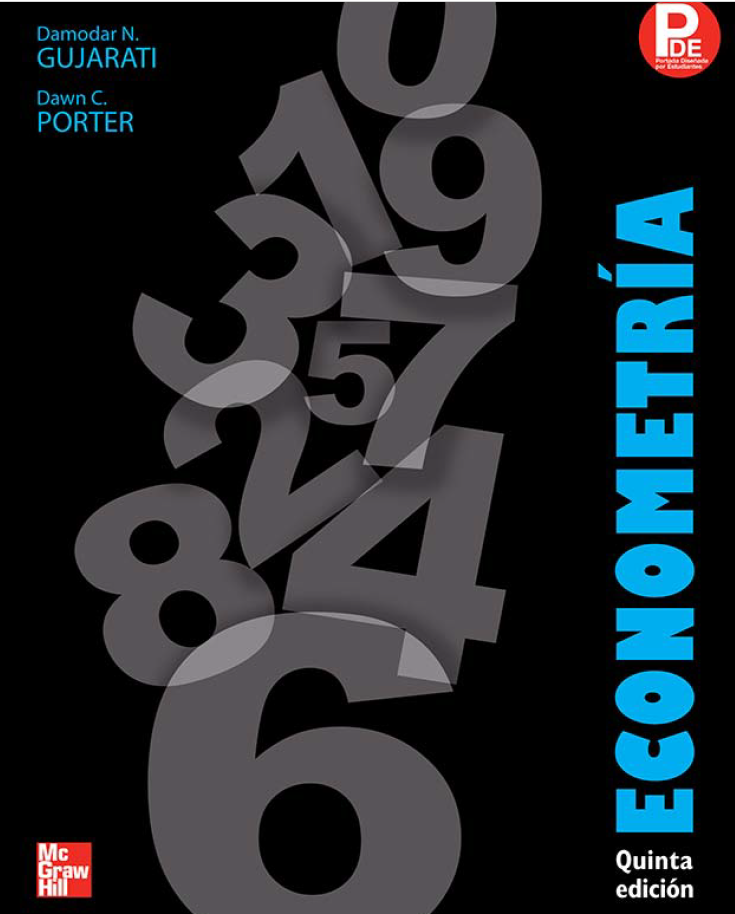

# 🚀 Aplicación de la función de producción Cobb-Douglas en R

Este es un repositorio con fines educativos que solo muestra el paso a paso como se aplica función de producción Cobb-Douglas en R usando unos datos del sector manufacturero de los 50 estados de Estados Unidos que están disponibles en la página 208 del texto de Gujarati y col. Econometría. 5ta. Edición McGraw Hill. 2010

## 🗃️ Datos y Variables
Los datos están transcritos y disponibles en formato csv en el siguiente link: https://raw.githubusercontent.com/estebanlab2021/fun_Cobb-Douglas/refs/heads/master/ejemplo_cobb_douglas.csv

Las variables de la base de atos son:

- Y = Producción (miles de dólares)
- X2= Insumo mano de obra (miles de horas de trabajo)
- X3= Insumo capital Inversión de capital (miles de dólares)

## 🌐 Proyecto

El proyecto se realizó en Markdown de R y se puede revisar en versión html en el siguiente link:  
👉 https://estebanlab2021.github.io/fun_Cobb-Douglas/ 

## 👨‍💻 Autor

Esteban Arroyo
